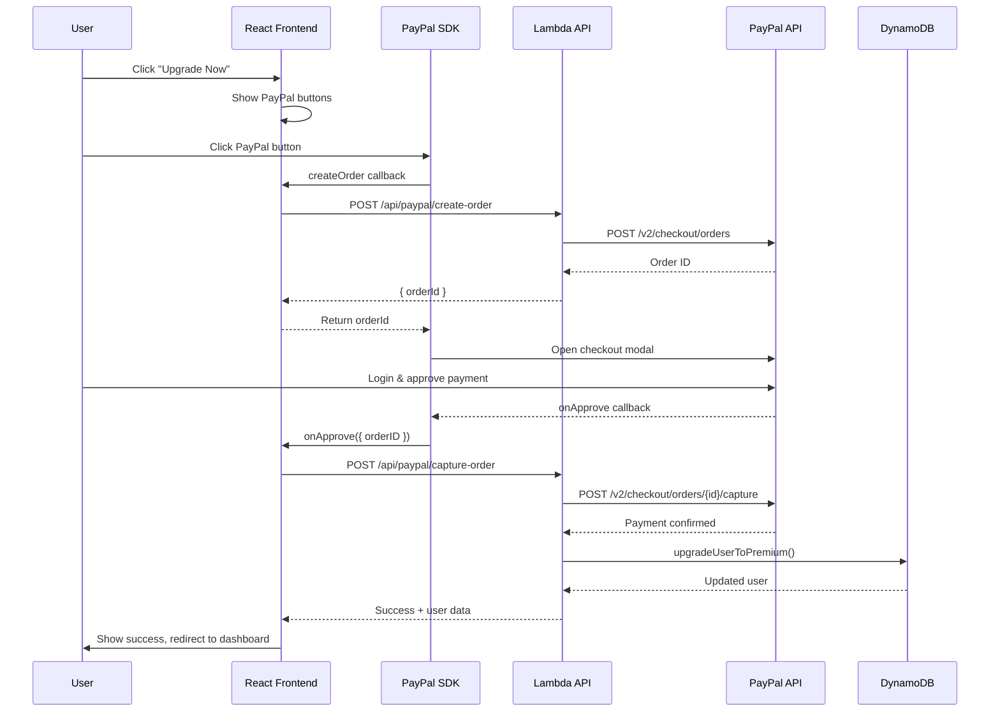

# Payment Processing - PayPal Integration

This document describes the payment processing architecture for GetQuickResume using PayPal Checkout with one-time payments.

## Table of Contents

1. [Architecture Overview](#architecture-overview)
2. [Payment Flow Diagram](#payment-flow-diagram)
3. [Implementation Details](#implementation-details)
4. [API Endpoints](#api-endpoints)
5. [Frontend Integration](#frontend-integration)
6. [Environment Configuration](#environment-configuration)
7. [Security Considerations](#security-considerations)
8. [Troubleshooting Guide](#troubleshooting-guide)

---

## Architecture Overview

GetQuickResume uses PayPal Checkout for processing one-time payments for premium subscriptions. The integration consists of:

- **PayPal JavaScript SDK**: Renders payment buttons on the frontend
- **Backend API (AWS Lambda)**: Creates and captures PayPal orders
- **PayPal Orders API**: Processes the actual payments
- **DynamoDB**: Stores user premium status and payment information

### Component Architecture

```
┌─────────────────────────────────────────────────────────────────────────┐
│                              FRONTEND                                   │
│  ┌─────────────────┐    ┌─────────────────┐    ┌──────────────────┐   │
│  │  PremiumPage    │    │  PricingPage    │    │  PayPal Service  │   │
│  │  (React)        │    │  (React)        │    │  (TypeScript)    │   │
│  └────────┬────────┘    └────────┬────────┘    └────────┬─────────┘   │
│           │                      │                      │              │
│           └──────────────────────┴──────────────────────┘              │
│                                  │                                      │
│                     ┌────────────▼────────────┐                        │
│                     │   PayPal JavaScript SDK  │                        │
│                     │   (Buttons & Checkout)   │                        │
│                     └────────────┬────────────┘                        │
└──────────────────────────────────┼──────────────────────────────────────┘
                                   │
                    ┌──────────────▼──────────────┐
                    │      API Gateway (AWS)      │
                    └──────────────┬──────────────┘
                                   │
┌──────────────────────────────────┼──────────────────────────────────────┐
│                              BACKEND                                    │
│                     ┌────────────▼────────────┐                        │
│                     │    Lambda Functions     │                        │
│                     │  ┌───────────────────┐  │                        │
│                     │  │ createPayPalOrder │  │                        │
│                     │  │ capturePayPalOrder│  │                        │
│                     │  └─────────┬─────────┘  │                        │
│                     └────────────┼────────────┘                        │
│                                  │                                      │
│           ┌──────────────────────┼──────────────────────┐              │
│           │                      │                      │              │
│  ┌────────▼────────┐  ┌─────────▼────────┐  ┌─────────▼────────┐      │
│  │ PayPal Service  │  │ DynamoDB Service │  │  AWS SSM Params  │      │
│  │ (API Client)    │  │ (User Storage)   │  │  (Credentials)   │      │
│  └────────┬────────┘  └──────────────────┘  └──────────────────┘      │
│           │                                                            │
└───────────┼────────────────────────────────────────────────────────────┘
            │
            ▼
┌──────────────────────┐
│   PayPal REST API    │
│   (Orders API v2)    │
└──────────────────────┘
```

---

## Payment Flow Diagram



---

## Implementation Details

### PayPal API Integration

The backend uses PayPal's Orders API v2 with OAuth 2.0 authentication.

#### Authentication Flow

1. Generate access token using client credentials
2. Token is cached until expiration (with 60s buffer)
3. All API calls use Bearer token authentication

```typescript
// Token request
POST https://api-m.paypal.com/v1/oauth2/token
Authorization: Basic base64(client_id:client_secret)
Content-Type: application/x-www-form-urlencoded
Body: grant_type=client_credentials
```

#### Order Creation

Orders are created with custom metadata to track the user and plan type:

```typescript
{
  intent: 'CAPTURE',
  purchase_units: [{
    reference_id: `${userId}_${planType}_${timestamp}`,
    description: 'GetQuickResume Premium - Monthly/Yearly',
    custom_id: JSON.stringify({ userId, planType }),
    amount: {
      currency_code: 'USD',
      value: '9.99' // or '59.99'
    }
  }]
}
```

#### Payment Capture

After user approval, the payment is captured server-side to ensure security:

```typescript
POST https://api-m.paypal.com/v2/checkout/orders/{order_id}/capture
Authorization: Bearer {access_token}
```

---

## API Endpoints

### POST `/api/paypal/create-order`

Creates a PayPal order for the specified plan.

**Authentication**: Required (Bearer token)

**Request Body**:
```json
{
  "planType": "monthly" | "yearly"
}
```

**Response** (200 OK):
```json
{
  "success": true,
  "orderId": "5O190127TN364715T",
  "approvalUrl": "https://www.sandbox.paypal.com/checkoutnow?token=5O190127TN364715T",
  "status": "CREATED"
}
```

**Error Response** (400/401/500):
```json
{
  "success": false,
  "error": "Error description"
}
```

### POST `/api/paypal/capture-order`

Captures payment after user approval and upgrades user to premium.

**Authentication**: Required (Bearer token)

**Request Body**:
```json
{
  "orderId": "5O190127TN364715T"
}
```

**Response** (200 OK):
```json
{
  "success": true,
  "message": "Payment completed successfully",
  "transactionId": "3U849721FG123456T",
  "planType": "monthly",
  "subscriptionExpiration": "2026-02-12T15:30:00.000Z",
  "user": {
    "id": "user_123",
    "email": "user@example.com",
    "isPremium": true,
    "planType": "monthly",
    "subscriptionExpiration": "2026-02-12T15:30:00.000Z"
  }
}
```

---

## Frontend Integration

### PayPal SDK Loading

The SDK is loaded dynamically when the user visits a payment page:

```typescript
const script = document.createElement('script');
script.src = `https://www.paypal.com/sdk/js?client-id=${CLIENT_ID}&currency=USD`;
script.async = true;
document.body.appendChild(script);
```

### Button Rendering

PayPal buttons are rendered using the SDK's Buttons component:

```typescript
window.paypal.Buttons({
  style: {
    layout: 'vertical',
    color: 'blue',
    shape: 'rect',
    label: 'pay',
    height: 45,
  },
  createOrder: async () => {
    const response = await paypalService.createOrder(planType);
    return response.orderId;
  },
  onApprove: async (data) => {
    const response = await paypalService.captureOrder(data.orderID);
    // Handle success
  },
  onError: (err) => {
    // Handle error
  },
  onCancel: () => {
    // Handle cancellation
  },
}).render('#paypal-button-container');
```

---

## Environment Configuration

### AWS SSM Parameters

Create these parameters in AWS SSM Parameter Store:

| Environment | Parameter Path | Description |
|-------------|----------------|-------------|
| Development | `/getquickresume/dev/paypal-client-id` | PayPal sandbox Client ID |
| Development | `/getquickresume/dev/paypal-client-secret` | PayPal sandbox Client Secret |
| Development | `/getquickresume/dev/paypal-environment` | `sandbox` |
| Production | `/getquickresume/prod/paypal-client-id` | PayPal live Client ID |
| Production | `/getquickresume/prod/paypal-client-secret` | PayPal live Client Secret |
| Production | `/getquickresume/prod/paypal-environment` | `live` |

### Frontend Environment Variables

| Variable | Description |
|----------|-------------|
| `VITE_PAYPAL_CLIENT_ID` | PayPal Client ID for SDK initialization |

### Backend Environment Variables (serverless.yml)

```yaml
environment:
  PAYPAL_CLIENT_ID: ${ssm:/getquickresume/${self:provider.stage}/paypal-client-id}
  PAYPAL_CLIENT_SECRET: ${ssm:/getquickresume/${self:provider.stage}/paypal-client-secret}
  PAYPAL_ENVIRONMENT: ${ssm:/getquickresume/${self:provider.stage}/paypal-environment}
```

---

## Security Considerations

### Server-Side Payment Verification

**CRITICAL**: All payment captures happen server-side, not client-side.

1. Client only receives order ID from create-order
2. Client cannot modify payment amounts
3. Server verifies user identity before capture
4. Server validates payment completion status

### Credentials Management

- Never expose `PAYPAL_CLIENT_SECRET` to the frontend
- Use AWS SSM Parameter Store with encryption
- IAM roles limit access to parameters

### Request Validation

- All endpoints require authentication
- User ID is extracted from JWT token
- Order metadata includes user ID for verification
- Mismatch between order user and request user is rejected

### Fraud Prevention

- Custom ID in orders allows tracing payments to users
- Payment capture requires authenticated request
- Duplicate capture attempts are handled by PayPal

---

## Troubleshooting Guide

### Common Issues

#### PayPal SDK Not Loading

**Symptoms**: "Loading..." spinner stays indefinitely

**Solutions**:
1. Check browser console for script errors
2. Verify `VITE_PAYPAL_CLIENT_ID` is set
3. Check for ad blockers blocking PayPal scripts
4. Ensure PayPal domain is not blocked by CSP

#### "Failed to create PayPal order"

**Symptoms**: Error when clicking PayPal button

**Solutions**:
1. Check backend logs for API errors
2. Verify SSM parameters are configured correctly
3. Ensure PayPal credentials are valid
4. Check if user is authenticated

#### Payment Capture Fails

**Symptoms**: User approves but capture fails

**Solutions**:
1. Check if order was already captured (idempotency)
2. Verify user has sufficient PayPal balance
3. Check for PayPal sandbox limitations
4. Review backend logs for API response

### Sandbox Testing

#### Test Account Credentials

Create sandbox accounts at: https://developer.paypal.com/dashboard/accounts

#### Test Card Numbers

PayPal sandbox accepts test cards:
- Visa: `4111111111111111`
- Mastercard: `5555555555554444`
- Any future expiry date
- Any 3-digit CVV

#### Sandbox Limitations

- Sandbox transactions are not real
- Some features behave differently in sandbox
- Always test in production mode before launch

### Debug Logging

Enable verbose logging in development:

```typescript
// Backend
console.log(`PayPal order created: ${orderId} for user ${userId}`);
console.log(`PayPal order captured: ${orderId}, status: ${status}`);

// Frontend
console.log('PayPal SDK loaded');
console.log('Order created:', response.orderId);
console.log('Payment captured:', response.transactionId);
```

---

## Pricing Configuration

| Plan | Price | Access Duration |
|------|-------|-----------------|
| Monthly | $9.99 USD | 1 month |
| Yearly | $59.99 USD | 12 months |

---

## Files Reference

| File | Purpose |
|------|---------|
| `api/src/services/paypalService.ts` | PayPal API client service |
| `api/src/handlers/paypalCheckout.ts` | Lambda handlers for checkout |
| `api/serverless.yml` | Lambda function definitions |
| `src/services/paypalService.ts` | Frontend API client |
| `src/pages/PremiumPage.tsx` | Premium upgrade page |
| `src/pages/PricingPage.tsx` | Pricing page |
